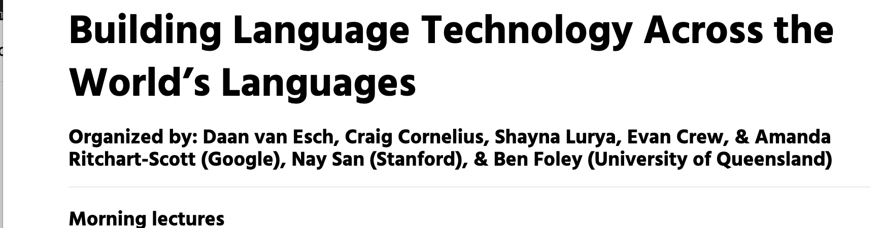

# 排版样例

## 嵌入图片

将图片放到 `docs/img` 文件夹下。然后在 md 文件中:

```

```

就会得到
 
---


*图为某某某某...*

---

> 要注意: 路径是相对的。比如在 `docs/nested/test.md`，同一个图片则要用 ``

## 嵌入音频 

### 播放器

```
<audio controls src="<音频网址>">你的浏览器不支持播放音频</audio>
```
<audio controls src="http://idioms.mindong.asia/assets/audio/2ae5b3ac-0408-4028-a9a0-5b642a219a56.mp3">
你的浏览器不支持播放音频
</audio>

### 点击文字播放 

1. 为需要播放音频的文字添加一个链接。链接的地址格式是 `#!标识符`，比如 `#!audio01`。这个标识符每个页面内的不同音频必须*不一样*（在不同页面可以重复）。

    ```markdown
    这个熟语是[这样念的 ▶️](#!audio01)
    ```

2. 在 md 文件的最后面，加入如下代码:

    ```html
    <script>
      var audioUrls = {
        "标识符1": "音频网址1",
        "标识符2": "音频网址2",
      }
    </script>
    ```
    比如:
    ```html
    <script>
    var audioUrls = {
        "audio01": "http://idioms.mindong.asia/assets/audio/2ae5b3ac-0408-4028-a9a0-5b642a219a56.mp3",
    }
    </script>
    ```

那么你便能得到：

---

这个熟语是[这样念的 ▶️](#!audio01)

---


## 嵌入视频

一般视频网站会提供嵌入代码。直接贴入。

<iframe src="//player.bilibili.com/player.html?aid=29214945&cid=50885854&page=1" scrolling="no" border="0" frameborder="no" framespacing="0" allowfullscreen="true"> </iframe>

## 表格

可以使用 [Markdown 表格生成器](https://tool.lu/tables/)


<script>
var audioUrls = {
    "audio01": "http://idioms.mindong.asia/assets/audio/2ae5b3ac-0408-4028-a9a0-5b642a219a56.mp3",
}
</script>
